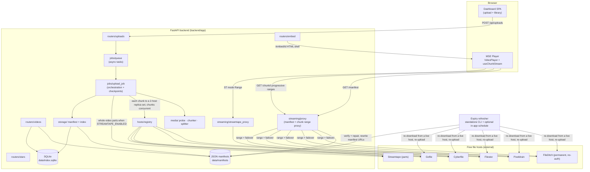
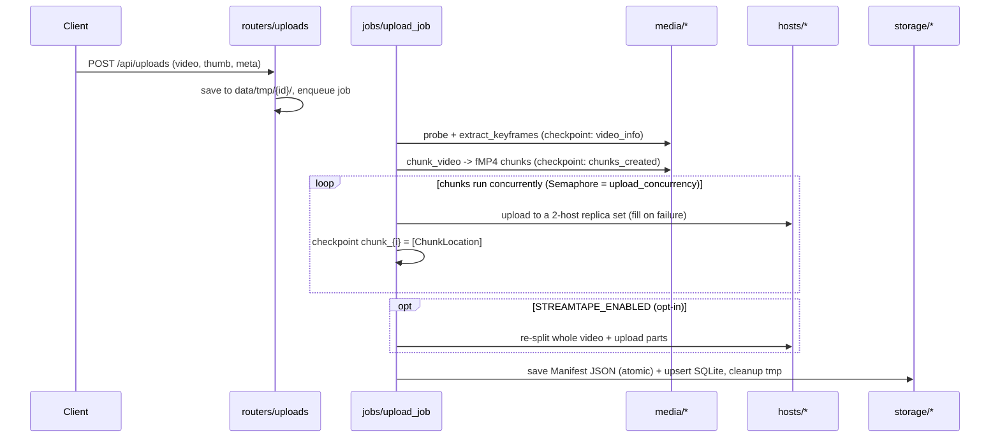

# VideoManager — Knowledge Graph

This folder is the **map of the codebase**. Read it (and [`graph.json`](./graph.json)) **before** opening source
files. The goal is that an agent or developer can understand the whole system from here and only open a
specific file when they need exact code to change it — saving time and tokens.

- **[`graph.json`](./graph.json)** — the machine-readable graph: every module, its role, exports, internal
  dependencies, the data model, the API surface, the end-to-end flows, and tracked issues.
- **This file** — a human-readable tour with diagrams.

> **Keep it in sync.** When you change code, update `graph.json` in the *same* change. See
> [Maintenance protocol](#maintenance-protocol) below. `meta.maintenance_protocol` in `graph.json` is the
> authoritative checklist.

---

## What the app does (one paragraph)

A self-hosted manager that takes an uploaded video, uses **ffprobe/ffmpeg** to split it **losslessly**
(`-c copy`, no re-encode, original quality preserved) into keyframe-aligned **fragmented-MP4 (fMP4) chunks**,
**fans those chunks out to several free file hosts** (Pixeldrain, Filester, Cyberfile, Gofile…), and writes a
**JSON manifest** describing every chunk and where its copies live. Playback is a **range-aware proxy** that
pulls chunk bytes from the best available host (failing over between hosts mid-stream) and feeds them to a
custom **MSE player** in the browser. An optional **Streamtape** path uploads whole-video parts and serves them
through a separate stitching proxy.

---

## Architecture



### Layers (where things live)

| Layer | Path | Responsibility |
|---|---|---|
| app | `backend/app/main.py` | FastAPI app, lifespan (init DB, resume jobs), route + static mounts |
| core | `config.py`, `models/` | settings from `.env`; all Pydantic schemas |
| routers | `routers/` | HTTP surface: uploads, videos, stars, embed |
| jobs | `jobs/` | async queue, **upload orchestration** with per-phase checkpoints, startup resume |
| media | `media/` | ffprobe metadata + keyframes, lossless fMP4 **chunker**, Streamtape **splitter** |
| hosts | `hosts/` | one adapter per file host (`upload` / `download_range` / `healthy`) + registry |
| images | `images/` | thumbnail adapters (Google Drive; jpg.su stub) |
| storage | `storage/` | read/write JSON **manifests** (source of truth) + sync to SQLite index |
| streaming | `streaming/` | MSE chunk **proxy** (+failover) and Streamtape virtual-stream proxy |
| frontend | `frontend/src/` | `player/` (MSE engine + UI) and `dashboard/` (upload + library) |

---

## The two flows you need to know

### Upload (lossless fan-out)



### Playback (MSE)

```mermaid
sequenceDiagram
  participant P as Player (useChunkStream)
  participant X as streaming/proxy
  participant H as file host
  P->>X: GET /api/stream/{id}/manifest
  X-->>P: StreamManifest (ok hosts per chunk, priority order)
  loop sequential worker, ≤3 ahead
    P->>X: GET /chunk/{i}  (read body as a stream)
    X->>H: download_range (first ok host; failover on error/short-read)
    H-->>X: bytes
    X-->>P: bytes -> append slices progressively (offset set on first slice)
  end
```
Playback starts after the **first slice**, not the whole chunk.

---

## Health assessment & what changed

Quality was never the problem — the app preserves **original quality** (ffmpeg `-c copy`, no transcode) on
**free** hosts. The issues were **upload speed**, **playback buffering**, and a **durability gap**. Status
(full detail + file refs in `graph.json → known_issues`):

**Fixed**
- `ISSUE-1` uploads now go to a **2-host replica set** (`replica_count`) instead of all hosts.
- `ISSUE-2` chunks upload **concurrently** (`upload_concurrency` semaphore).
- `ISSUE-3` Streamtape is **opt-in** (`STREAMTAPE_ENABLED`), so the whole video isn't re-uploaded by default.
- `ISSUE-4` the player **streams each chunk and appends slices progressively** — playback starts before the
  whole chunk arrives; default `chunk_size_bytes` lowered to 6 MB.
- `ISSUE-7` chunk-size default aligned + documented.
- `ISSUE-8` the **standalone expiry refresher** (`python -m backend.app.refresher`) verifies/keeps-alive every
  copy and re-downloads+re-uploads to maintain the replica count, rewriting manifest URLs.

**Still open** (intentionally / future)
- `ISSUE-6` no on-disk proxy cache (per the chosen approach; an in-memory per-chunk cache covers re-seeks).
- `ISSUE-5` still a single download worker (mitigated by progressive append + smaller chunks).
- `ISSUE-9` Buzzheavier wired but unused · `ISSUE-10` `resolver.py` dead code · `ISSUE-11` no per-job host health gate.

---

## Maintenance protocol

When you change the code, update this graph in the **same** change so it never drifts:

1. **Add/modify a file** → add/update its entry in `graph.json → modules` (path, role, exports,
   `imports_internal`, `touches_services`, notes).
2. **Change an import relationship** → update `graph.json → edges`.
3. **Change a Pydantic / TS model** → update `graph.json → data_models`.
4. **Add/change a route** → update `graph.json → endpoints`.
5. **Change upload/playback/resume behavior** → update the relevant list in `graph.json → flows`.
6. **Fix or introduce a perf/correctness gap** → update `graph.json → known_issues`
   (set `"status": "resolved"` when fixed, with the commit/PR if available).
7. Bump `meta.generated`; bump `meta.schema_version` for structural changes.

Keep entries **terse** — one line of behavior per symbol. The graph is an index, not a copy of the code.

> Tip: this protocol is also encoded in the root **`CLAUDE.md`**, which tells future Claude Code sessions to
> read the graph first and update it after edits.
